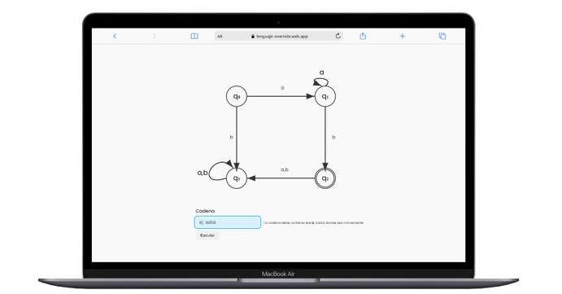
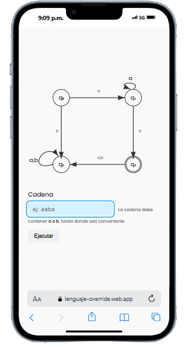

**Autómatas Finitos**

**Propósito:**  
Este programa implementa un autómata finito determinista (AFD) que evalúa cadenas de entrada compuestas por los símbolos `a` y `b`. Su objetivo es determinar si una cadena específica pertenece al lenguaje definido por el autómata, visualizando paso a paso su recorrido a través de los estados y mostrando un resultado final ("aceptada" o "rechazada") según si termina en un estado de aceptación (`q2`, marcado con un doble círculo).

---

**Funcionamiento Detallado:**  
1. **Estructura del Autómata:**  
   - **Estados:** `q0` (inicial), `q1`, `q2` (aceptación), `q3`.  
   - **Transiciones:** Definidas mediante un objeto `T`, donde cada estado tiene reglas para transitar según `a` o `b`.  
     - Ejemplo: Desde `q0`, `a` lleva a `q1`, mientras que `b` lleva a `q3`.  

2. **Proceso de Evaluación:**  
   - La cadena de entrada se procesa carácter por carácter.  
   - Para cada símbolo, el programa busca la transición válida desde el estado actual.  
   - Si no existe una transición para un símbolo (ej: caracteres no permitidos), se muestra un error.  
   - Durante el recorrido, se resaltan visualmente los estados y flechas correspondientes a las transiciones activas.  

3. **Resultado Final:**  
   - Si la cadena termina en `q2`, se acepta (mensaje verde).  
   - En caso contrario, se rechaza (mensaje rojo).  

---

**Concepto Teórico Subyacente:**  
Los **autómatas finitos** son modelos matemáticos utilizados en teoría de la computación para reconocer patrones en cadenas de símbolos. Un AFD consta de:  
- Un conjunto finito de estados.  
- Un alfabeto de entrada.  
- Transiciones deterministas entre estados.  
- Un estado inicial y uno o más estados de aceptación.  

Este programa representa un caso práctico de un AFD diseñado para validar cadenas que cumplen con un patrón específico. Por ejemplo, el lenguaje aceptado podría ser: *"cadenas que contienen al menos un `b` después de al menos un `a`"* (ej: `aab`, `abab`, `aaabbb`).  

---

**Aplicaciones Prácticas:**  
1. **Validación de Entradas:**  
   - Verificar formatos simples (ej: contraseñas con requisitos específicos).  
2. **Compiladores y Analizadores Lexicográficos:**  
   - Identificar tokens en lenguajes de programación.  
3. **Herramientas Educativas:**  
   - Visualizar el funcionamiento de autómatas para fines didácticos.  
4. **Procesamiento de Texto:**  
   - Filtrar o clasificar datos basados en patrones predefinidos.  

---

**Implementación Técnica Destacada:**  
- **Animación Interactiva:** Uso de funciones asíncronas (`await delay`) para simular el paso del tiempo durante el recorrido.  
- **Resaltado Visual:** Estilos CSS dinámicos para enfocar estados y transiciones activas.  
- **Manejo de Errores:** Validación de caracteres no permitidos y retroalimentación inmediata al usuario.  

Este programa sirve como ejemplo claro de cómo abstraer conceptos teóricos en una herramienta interactiva, facilitando tanto el aprendizaje como la aplicación práctica de autómatas finitos.
